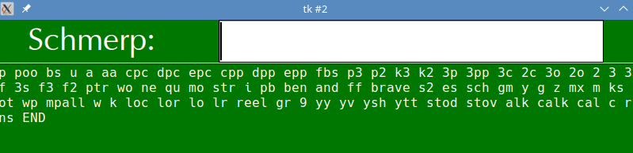
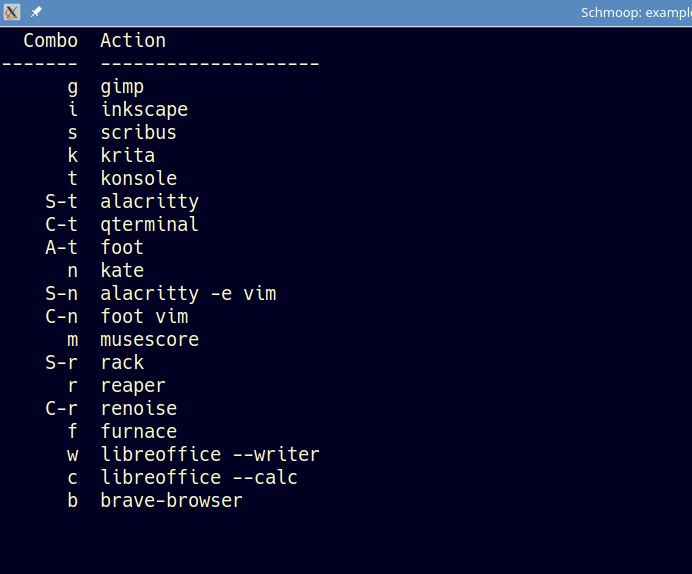

# Schmerp and Schmoop
Two silly names, to ensure they don't clash with anything else.
I use them as launchers on my KDE/Linux machines.
I bind Schmerp to `A-C-M-space`, and have a few Schmoop launchers,
e.g. `A-C-M-l` is a page of shortcuts 

Schmerp is basically the first thing I wrote with Tkinter, playing around.
I came up with this, and it worked. Schmoop was largely written by ChatGPT.

## A-C-M-S-convention
For writing key combos, I use e.g. `A-x` for "Alt+X", `C-M-p` for "Control+Meta+P" and so on.
Some keys are named like `minus`. The key name is all lowercase, so as to make distinguishing
modifiers trivial (so `A-m` cannot be read as `Alt-M` -- this was to allow for chords like
`A-m-n` for "Alt with M and N both held down" and stuff like that but I never found the need).

## Schmerp

This is for writing terse shorthands. It also launches any existing command line program in the PATH (e.g. `konsole` or `xlogo`).
It is configured with a simple JSON file. At some point I'll move over to how things are in Schmoop
files, since JSON's complexity is unnecessary. (I had allowed for shorthands for multiple commands
with environment variables and such, but it is easier to delegate such complexity to external
scripts.)

Two examples are included `schmerp` and `magic_u`, the latter I bind to `A-C-M-u` to launch various web aliases.
The actual code to run the aliases is not here.

## Schmoop

Displays a page of shortcuts: the key and the command it runs.
Put `!noautoexit` on its own line and it won't exit when a command is run.
Put `!autoexit` on its own line and it will.
Run with `schmoop -x name` and it will load with `!noautoexit` by default.
Put `!autoexit` or `!noautoexit` at the end of a line to modify autoexit for that particular command.

